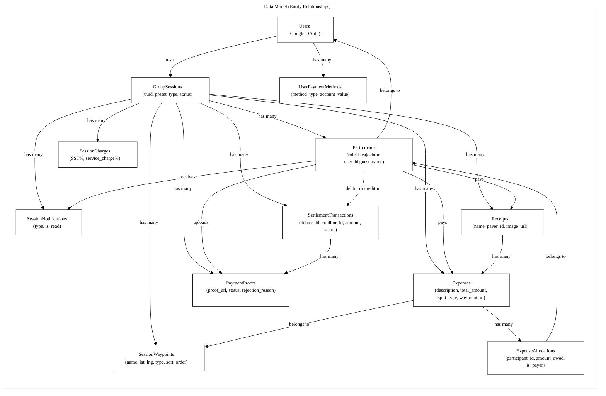

```mermaid
%%{init: {'theme':'base', 'themeVariables': {
  'primaryColor':'#ffffff',
  'primaryBorderColor':'#000000',
  'primaryTextColor':'#000000',
  'lineColor':'#000000',
  'fontSize':'13px',
  'fontFamily':'Segoe UI, Arial, sans-serif'
}}}%%

flowchart TD

subgraph Split_Engine ["Expense Split Engine"]
    S_Start([Expense Created]) --> S_Type{split_type?}

    S_Type -->|equal| S_Equal["total / num_consumers<br/>last consumer absorbs rounding remainder"]
    S_Type -->|percentage| S_Pct["total x pct / 100 per consumer<br/>validates sum = 100%"]
    S_Type -->|exact| S_Exact["exact RM per consumer<br/>validates sum = total_amount"]

    S_Equal --> S_Save[Save ExpenseAllocations]
    S_Pct --> S_Save
    S_Exact --> S_Save

    S_Save --> S_Done([Allocations Recorded])
end

subgraph Road_Trip_Engine ["Road Trip Map Engine"]
    RT_Start([Session Opened]) --> RT_Load["Load SessionWaypoints<br/>sorted by: Start then Stop/Toll then Destination"]
    RT_Load --> RT_Map["Render Leaflet.js Map<br/>OpenStreetMap tiles"]
    RT_Map --> RT_Markers["Place Markers<br/>Green=Start, Blue=Stop, Orange=Toll, Red=Dest"]
    RT_Markers --> RT_Route["Leaflet Routing Machine<br/>draws driving route through waypoints"]
    RT_Route --> RT_Timeline["Render Timeline UI<br/>each node shows linked expenses"]
end
```

```mermaid
%%{init: {'theme':'base', 'themeVariables': {
  'primaryColor':'#ffffff',
  'primaryBorderColor':'#000000',
  'primaryTextColor':'#000000',
  'lineColor':'#000000',
  'fontSize':'13px',
  'fontFamily':'Segoe UI, Arial, sans-serif'
}}}%%

flowchart TD

%% ================= HOST FLOW =================
subgraph Host_Flow ["Host Flow"]
    Start_H([Host Entry]) --> H_Auth[Google OAuth Authentication]
    H_Auth --> H_Create[Create Session Details]
    H_Create --> H_Preset{Select Session Preset}

    H_Preset -->|Food and Dining| H_Conf_F["Configure SST%,<br/>Proportional Split"]
    H_Preset -->|Grocery Run| H_Conf_G["Itemized Receipt,<br/>0% Service Charge"]
    H_Preset -->|Road Trip| H_Conf_R["Flat Amounts,<br/>Equal Split,<br/>Map Routing"]
    H_Preset -->|Long Trip| H_Conf_L["Collaborative Ledger,<br/>Net-Debt Settlement"]
    H_Preset -->|Custom| H_Conf_C[Manually Toggle All Rules]

    H_Conf_F --> H_Charges[Save Session Charges]
    H_Conf_G --> H_Charges
    H_Conf_R --> H_Charges
    H_Conf_L --> H_Charges
    H_Conf_C --> H_Charges

    H_Charges --> H_QR[Generate UUID and QR Code]
    H_QR --> H_View[Open Session View]
    H_View --> H_Preset_Check{Session Preset?}

    %% Road Trip specific flow
    H_Preset_Check -->|Road Trip| H_RT_Map["Interactive Map UI<br/>Leaflet.js + OpenStreetMap"]
    H_RT_Map --> H_RT_WP{Manage Waypoints — Host Only}
    H_RT_WP --> H_RT_Add_Start["Add Start Point<br/>Nominatim Search"]
    H_RT_WP --> H_RT_Add_Stop["Add Stop / Toll<br/>Nominatim Search"]
    H_RT_WP --> H_RT_Add_Dest["Add Destination<br/>Nominatim Search"]
    H_RT_WP --> H_RT_Del[Delete Waypoint]

    H_RT_Add_Start --> H_RT_Route["Leaflet Routing Machine draws route"]
    H_RT_Add_Stop --> H_RT_Route
    H_RT_Add_Dest --> H_RT_Route
    H_RT_Del --> H_RT_Route

    H_RT_Route --> H_Exp_At_WP["Add Expense at<br/>Specific Waypoint"]
    H_Exp_At_WP --> H_Exp_Choice

    %% Standard flow for other presets
    H_Preset_Check -->|Other Presets| H_Exp_Choice{Add Expense Type}

    H_Exp_Choice -->|Single Expense| H_Single[Single Expense Form]
    H_Exp_Choice -->|Itemized Receipt| H_Receipt[Itemized Receipt Form]

    %% Split method selection
    H_Single --> H_Split{Select Split Method}
    H_Split -->|Equal| H_Split_Equal[Divide Equally Among Selected]
    H_Split -->|Percentage| H_Split_Pct["Custom % Per Person<br/>Must Sum to 100%"]
    H_Split -->|Exact Amount| H_Split_Exact["Custom RM Per Person<br/>Must Match Total"]

    H_Split_Equal --> H_Alloc[Save Expense Allocations]
    H_Split_Pct --> H_Alloc
    H_Split_Exact --> H_Alloc

    H_Receipt --> H_Line_Items["Add Line Items<br/>Each With Own Split Method"]
    H_Line_Items --> H_Alloc

    H_Alloc --> H_Mon[Monitor Entries and Payment Status]

    %% Edit / Delete existing
    H_Mon --> H_Edit_Exp[Edit Expense<br/>Recalculate Allocations]
    H_Edit_Exp --> H_Mon
    H_Mon --> H_Del_Exp[Delete Expense]
    H_Del_Exp --> H_Mon

    %% Lock / Unlock
    H_Mon --> H_Lock[Lock Session<br/>Freeze Entries]
    H_Lock --> H_Unlock[Unlock Session<br/>Re-open Entries]
    H_Unlock --> H_Mon

    %% Close flow
    H_Lock --> H_Preview[Preview Close<br/>Calculate Settlements]
    H_Preview --> H_Settle[Net Debt Settlement Engine]
    H_Settle --> H_Txns[Generate Settlement Transactions]
    H_Txns --> H_Close[Close Session Immediately]
    H_Close --> H_Closed([Session Closed])
    H_Closed --> H_Proof_Review{Host Reviews Proofs — async, post-close}
    H_Proof_Review -->|Approve Proof| H_Mark_Settled[Mark Transaction as Settled]
    H_Mark_Settled --> H_Proof_Review
    H_Proof_Review -->|Reject Proof| H_Notify[Notify Participant to Reupload]
    H_Notify --> H_Proof_Review
end

%% ============= PARTICIPANT FLOW =============
subgraph Participant_Flow ["Participant Flow"]
    Start_P([Participant Entry]) --> P_Scan[Scan QR Code / Open Join Link]
    P_Scan --> P_Full{Session Full?}

    P_Full -->|Yes| P_Denied([Access Denied])
    P_Full -->|No| P_Choice{Login or Guest}

    P_Choice -->|Login| P_Auth[Google OAuth Authentication]
    P_Choice -->|Guest| P_Warn_G[Show No Recovery Warning]

    P_Warn_G --> P_Name[Enter Display Name Only]
    P_Auth --> P_Join[Join Session]
    P_Name --> P_Join

    P_Join --> P_View[View Session Dashboard]
    P_View --> P_Preset_Check{Session Preset?}

    %% Road Trip view
    P_Preset_Check -->|Road Trip| P_RT_View["View Interactive Map<br/>and Timeline — read only"]
    P_RT_View --> P_RT_Exp["Add Expense Linked to<br/>Existing Waypoint Only"]
    P_RT_Exp --> P_Add_Exp_Choice

    %% Standard view
    P_Preset_Check -->|Other Presets| P_Add_Exp_Choice{Add Expense Type}

    P_Add_Exp_Choice -->|Single Expense| P_Single[Single Expense Form]
    P_Add_Exp_Choice -->|Itemized Receipt| P_Receipt[Itemized Receipt Form]

    P_Single --> P_Split{Select Split Method}
    P_Split -->|Equal| P_Split_Equal[Divide Equally Among Selected]
    P_Split -->|Percentage| P_Split_Pct["Custom % Per Person"]
    P_Split -->|Exact Amount| P_Split_Exact["Custom RM Per Person"]

    P_Split_Equal --> P_Alloc[Save Expense Allocations]
    P_Split_Pct --> P_Alloc
    P_Split_Exact --> P_Alloc

    P_Receipt --> P_Line_Items["Add Line Items<br/>Each With Own Split"]
    P_Line_Items --> P_Alloc

    P_Alloc --> P_Calc_Share[View Calculated Individual Share]

    %% Payment flow
    P_Calc_Share --> P_Wait_Lock{Session Locked?}
    P_Wait_Lock -->|No| P_View
    P_Wait_Lock -->|Yes| P_View_Txn[View Settlement Transaction]
    P_View_Txn --> P_Txn_Role{Role in Transaction?}
    P_Txn_Role -->|Debtor| P_Up_Proof[Upload Payment Proof]
    P_Up_Proof --> P_Wait{Await Host Approval}
    P_Wait -->|Rejected| P_Up_Proof
    P_Wait -->|Approved| P_Verified([Payment Verified])
    P_Txn_Role -->|Creditor| P_Confirm_Settle[Confirm Payment Received]
    P_Confirm_Settle --> P_Verified
end

%% Hidden link to force vertical stacking
H_Closed ~~~ P_Scan

%% =========== CROSS-FLOW & POST-SESSION ===========
P_Name -..- > G_Risk{Browser Tab Closed?}
G_Risk -..-|Yes| G_Loss([Permanent Access Loss])

H_Closed --> Hist_Check{User Role Check}
Hist_Check -->|Registered| Hist_View[View Session History and Balances]
Hist_Check -->|Guest| G_Loss
```

---



---

