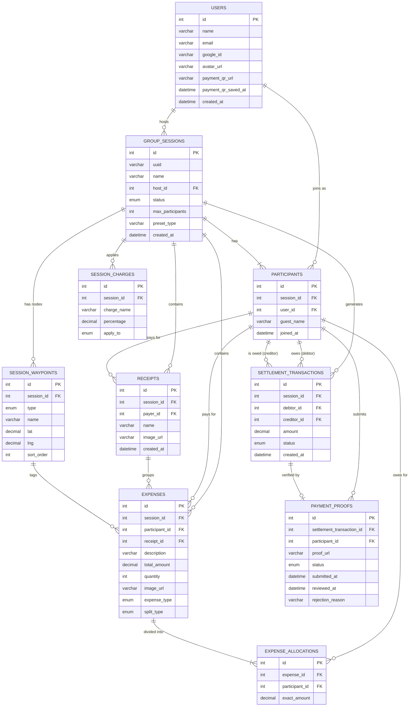

# Proposal Impact Assessment

This document outlines the necessary updates to the original Project Proposal to accurately reflect recent technical and architectural decisions. These updates ensure the documentation matches the actual implemented system.

## 1. Updates from Data Storage Decision (Cloudinary)

Based on the decision to use Cloudinary for securely storing private payment proofs and payment QR codes, the following updates are required for the proposal:

### 1.1 Data Dictionary Updates (Section 5.4)
Two new fields must be added to **Table 5.1 USERS**:

| Field Name | Data Type | Constraints | Description |
| :--- | :--- | :--- | :--- |
| `payment_qr_url` | VARCHAR(255) | NULLABLE | Cloudinary private URL of user's saved payment QR code |
| `payment_qr_saved_at` | DATETIME | NULLABLE | Timestamp when payment QR was saved by user |

### 1.2 ERD Updates (Section 5.3.1)
The `USERS` entity in the ERD must be updated to include the two new fields. *(See Section 3 for the complete updated Mermaid ERD source code).*

---

## 2. Updates from Itemized Receipts Feature (Option B)

To support long grocery receipts and quantity tracking without cluttering the main session dashboard, the system architecture has been updated to use a "Receipt Groups" approach.

### 2.1 Data Dictionary Updates
A new table must be added to the Data Dictionary for Receipts, and the Expenses table must be updated.

**New Table: RECEIPTS**
| Field Name | Data Type | Constraints | Description |
| :--- | :--- | :--- | :--- |
| `id` | INT | PRIMARY KEY, AUTO_INCREMENT | Unique identifier for the receipt |
| `session_id` | INT | FOREIGN KEY, NOT NULL | Links to the `group_sessions` table |
| `payer_id` | INT | FOREIGN KEY, NOT NULL | Links to the `participants` table (who paid) |
| `name` | VARCHAR(255) | NOT NULL | Display name of the receipt (e.g., "Tesco Groceries") |
| `image_url` | VARCHAR(255) | NULLABLE | Cloudinary URL of the uploaded physical receipt |
| `created_at` | DATETIME | NOT NULL | Creation timestamp |

**Updated Table: EXPENSES**
Three new fields must be added to the existing Expenses table:
| Field Name | Data Type | Constraints | Description |
| :--- | :--- | :--- | :--- |
| `receipt_id` | INT | FOREIGN KEY, NULLABLE | Links to `receipts` table. Groups multiple expenses under one receipt. |
| `quantity` | INT | NOT NULL, DEFAULT 1 | The quantity of the specific line item. |
| `image_url` | VARCHAR(255) | NULLABLE | Cloudinary URL of the uploaded physical receipt (for standalone expenses) |

**Updated Table: GROUP_SESSIONS**
The following fields can be safely removed, as receipt attachments are now handled on an item-by-item basis:
| Field Name | Action | Description |
| :--- | :--- | :--- |
| `reference_doc_url` | **REMOVE** | No longer needed at the session level |
| `reference_doc_type` | **REMOVE** | No longer needed at the session level |

---

## 3. Updates from Road Trip Interactive Map Feature (Option B - Leaflet.js)

To support a dynamic, visual mapping of routes for the "Road Trip" preset, the system architecture has been updated to include Waypoints. This allows expenses (like tolls or food) to be explicitly tied to nodes on an interactive map.

### 3.1 Data Dictionary Updates
A new table must be added to the Data Dictionary for Waypoints, and the Expenses table must be updated.

**New Table: SESSION_WAYPOINTS**
| Field Name | Data Type | Constraints | Description |
| :--- | :--- | :--- | :--- |
| `id` | INT | PRIMARY KEY, AUTO_INCREMENT | Unique identifier for the waypoint |
| `session_id` | INT | FOREIGN KEY, NOT NULL | Links to the `group_sessions` table |
| `type` | ENUM | NOT NULL | `start`, `stop`, `toll`, `destination` |
| `name` | VARCHAR(255) | NOT NULL | Display name of the waypoint location |
| `lat` | DECIMAL(10,8) | NULLABLE | Latitude coordinate for map plotting |
| `lng` | DECIMAL(11,8) | NULLABLE | Longitude coordinate for map plotting |
| `sort_order` | INT | NOT NULL, DEFAULT 0 | Sequential order of the waypoint in the route |

**Updated Table: EXPENSES**
One new field must be added to the existing Expenses table:
| Field Name | Data Type | Constraints | Description |
| :--- | :--- | :--- | :--- |
| `waypoint_id` | INT | FOREIGN KEY, NULLABLE | Links to `session_waypoints` table. Tags an expense to a specific node on the map. |

---

## 4. Complete Updated Mermaid ERD Source Code
Please copy the following Mermaid code and paste it into [mermaid.live](https://mermaid.live) to generate the updated ERD diagram for your proposal. 

This updated ERD includes the Cloudinary fields, the Receipts table, and the new **SESSION_WAYPOINTS table & relationships**.

